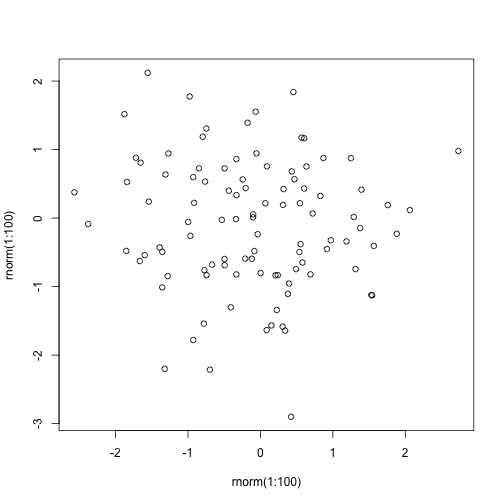

## setting variables


```r
y <- rnorm(1:10)
x1 <- rnorm(1:10)
x2 <- rnorm(1:10)
x3<- rnorm(1:10)
```

---

## Read-And-Delete


```r
fit <- lm(y ~ x1 + x2 + x3)
#!summary(fit)
```


--- .class #id 

## Slide 2

So, this is slide 2

--- .class #id 

## Slide 3

But this is slide 3.  I think I'm going to be seeing quite a lot of you

--- .class #id 

## Slide 4


```r
plot(rnorm(1:100), rnorm(1:100))
```

 
